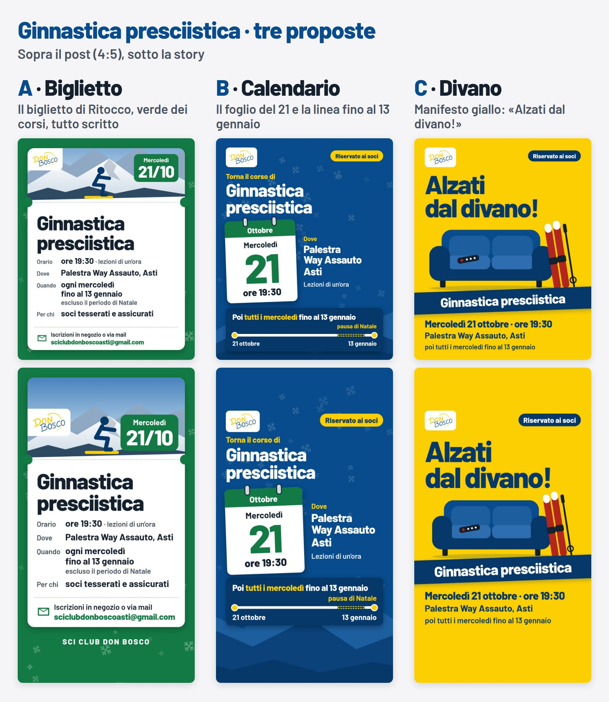
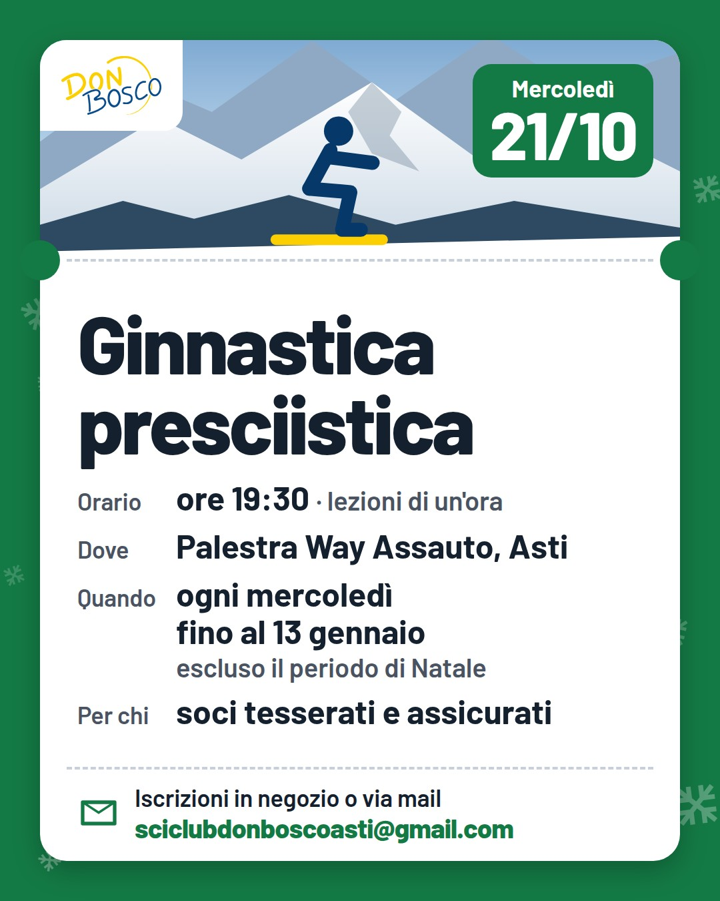
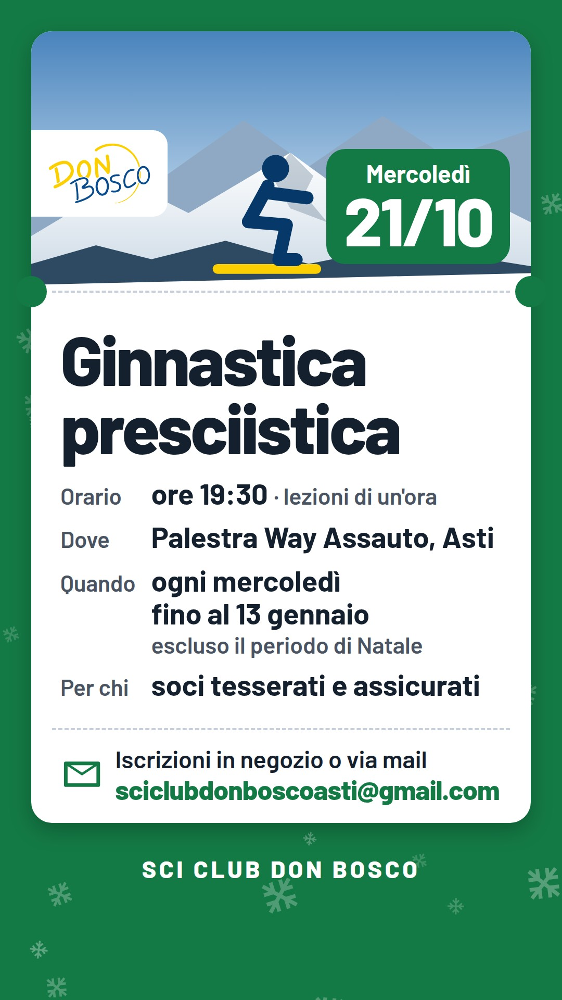
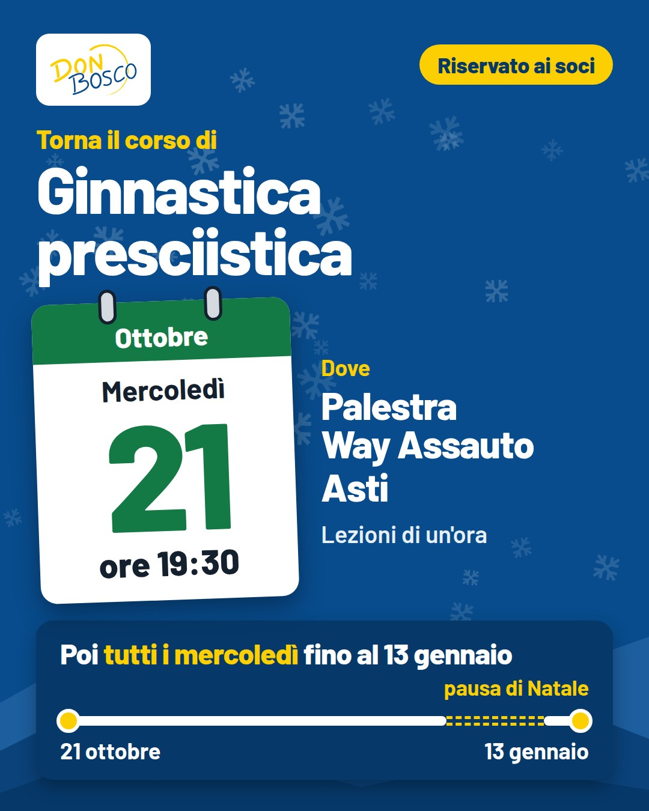
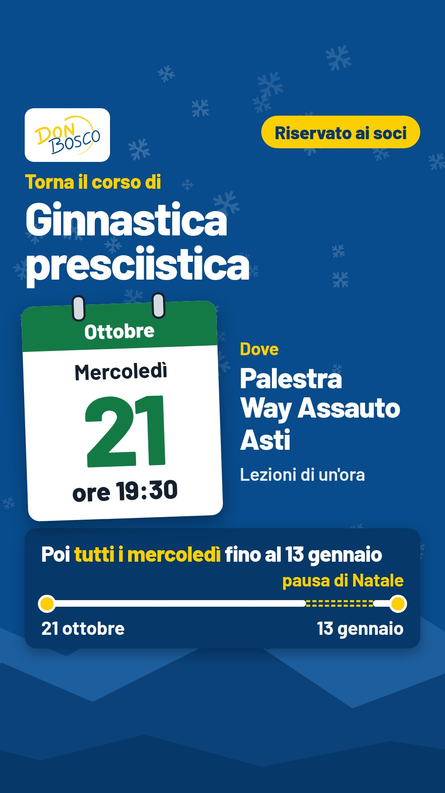
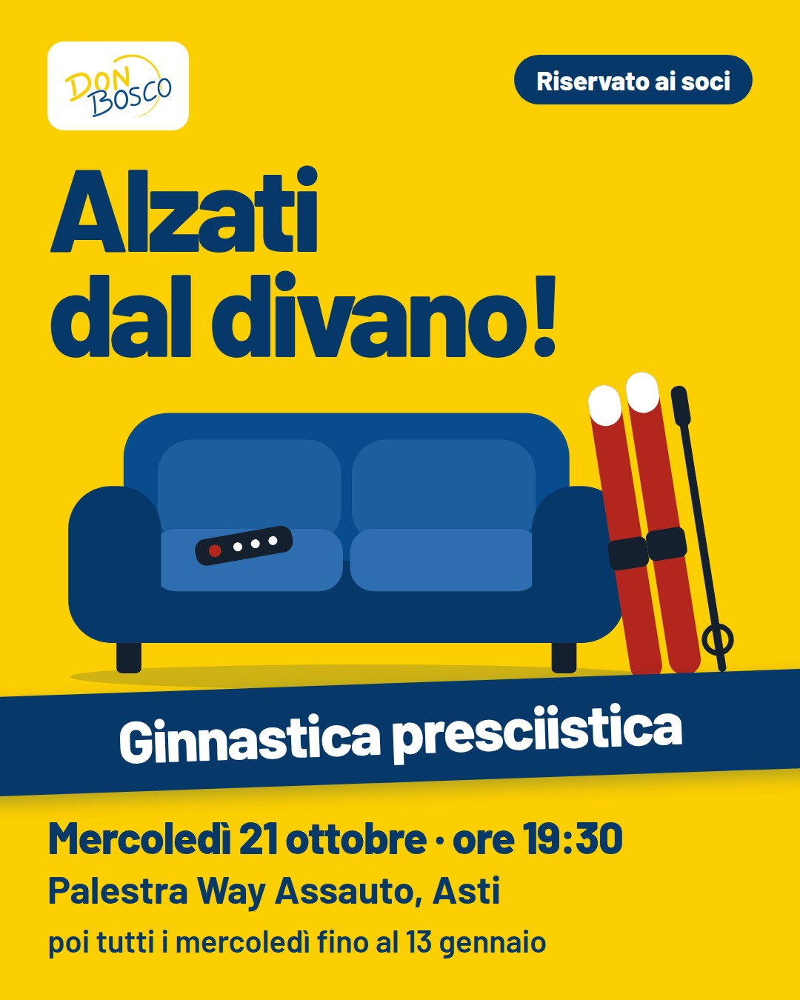
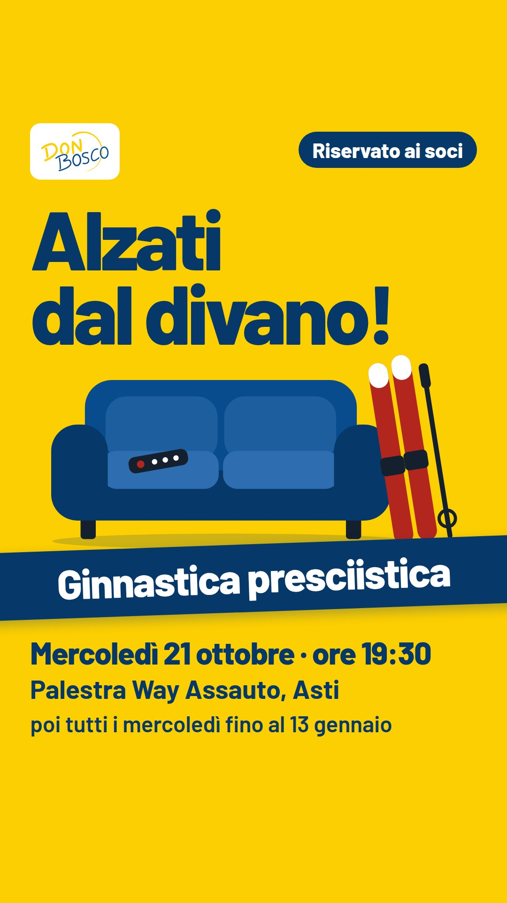

# Ginnastica presciistica 2026 · tre proposte



Tre grafiche per annunciare il corso su Instagram e Facebook. Per ognuna:
il **post** 4:5 (1080×1350, come Montagna) e la **story** (1080×1920).

- Testi presi dalla mail `Mail per Presciistica.docx`, niente di aggiunto:
  niente prezzo, niente nome dell'istruttore, niente telefoni.
- Testo grande: almeno 34 px nel post e 44 px nella story.
- Story: niente di importante nei 250 px in alto e nei 340 px in basso,
  dove Instagram mette il profilo e la risposta.

**Regola per dividere immagine e testo.** L'immagine gira da sola (WhatsApp,
schermate, inoltri): deve dire almeno cosa, quando, dove e per chi. Il testo
del post porta il resto: istruttore, durata, pausa di Natale, requisiti,
come iscriversi. La mail va sempre anche nel testo, perché dal testo si può
copiare e da un'immagine no.

---

## A · Biglietto

 

**Idea.** È Ritocco portato al 4:5: il biglietto bianco sul verde dei corsi,
con il bollo della data in alto. Al posto della foto, il paesaggio disegnato
con una figura in posizione da sci. È la più vicina a quello che c'è già e
può diventare il modello "corso" di Genera post.

**Nell'immagine:** tutto. Titolo, primo giorno, orario e durata, palestra,
ogni mercoledì fino al 13 gennaio escluso Natale, per chi, iscrizioni e mail.

**Nel testo:** l'invito, l'istruttore dello scorso anno, le stesse
informazioni scritte per esteso.

**Perché:** è il biglietto completo, come quelli delle gite: chi lo riceve
inoltrato ha tutto quello che serve. È la più fitta delle tre.

```text
Alzati dal divano: è ora di prepararsi alla prossima stagione sci! ⛷️

Mercoledì 21 ottobre 2026 alle 19:30 riparte il corso
di ginnastica presciistica, nella palestra della Way Assauto di Asti.
Lezioni di un'ora con l'istruttore dello scorso anno,
tutti i mercoledì fino al 13 gennaio 2027 (escluso il periodo di Natale).

Il corso è riservato ai soci tesserati e assicurati
con lo Sci Club Don Bosco Asti.
Iscrizioni come sempre in negozio o via mail:
sciclubdonboscoasti@gmail.com

Vi aspettiamo numerosi!
#sciclubdonbosco #presciistica #sci
```

---

## B · Calendario

 

**Idea.** Il messaggio è la data. Un foglio di calendario con il 21 ottobre
e sotto una linea del tempo fino al 13 gennaio, con la pausa di Natale.
Fondo blu del club con neve e montagne, come Montagna.

**Nell'immagine:** primo giorno e ora, palestra, durata della lezione,
tutti i mercoledì fino al 13 gennaio, pausa di Natale, "Riservato ai soci".

**Nel testo:** soci tesserati e assicurati, istruttore, come iscriversi e mail.

**Perché:** chi salva l'immagine come promemoria vede subito giorno, ora e
fino a quando dura. Come iscriversi serve una volta sola: sta nel testo.

**Da controllare:** sulla linea la pausa di Natale è indicativa (fine
dicembre – inizio gennaio), perché la mail non dà le date precise.

```text
📅 Segnatevi il mercoledì: dal 21 ottobre torna la ginnastica presciistica!

Ci vediamo alle 19:30 nella palestra della Way Assauto di Asti,
poi tutti i mercoledì fino al 13 gennaio 2027 (escluso il periodo di Natale).
Un'ora di preparazione mirata allo sci, con l'istruttore dello scorso anno.

👉 Riservato ai soci tesserati e assicurati con lo Sci Club Don Bosco Asti.
✍️ Iscrizioni come sempre in negozio o via mail:
sciclubdonboscoasti@gmail.com

#sciclubdonbosco #presciistica #sci
```

---

## C · Divano

 

**Idea.** Un manifesto. La prima riga della mail, «Alzati dal divano!»,
diventa il titolo, enorme, sul giallo del logo; sotto, un divano vuoto con
il telecomando lasciato lì e gli sci appoggiati. È la più diversa dai post
di sempre e quella che si nota di più scorrendo.

**Nell'immagine:** solo il titolo, il nome del corso, il primo appuntamento
(giorno, ora, palestra), "poi tutti i mercoledì fino al 13 gennaio" e
"Riservato ai soci".

**Nel testo:** tutto il resto.

**Perché:** un manifesto funziona se si legge in un secondo: poche righe,
grandissime. Chi è interessato apre il testo. Sul giallo si scrive solo blu
scuro e il logo sta su bianco, come chiedono le regole del marchio.

```text
Alzati dal divano: la prossima stagione sci si prepara adesso! 🛋️⛷️

Corso di ginnastica presciistica
📅 Si comincia mercoledì 21 ottobre 2026 alle 19:30
📍 Palestra della Way Assauto, Asti
🔁 Tutti i mercoledì fino al 13 gennaio 2027, escluso il periodo di Natale
⏱️ Lezioni di un'ora con l'istruttore dello scorso anno

Riservato ai soci tesserati e assicurati con lo Sci Club Don Bosco Asti.
Iscrizioni come sempre in negozio o via mail:
sciclubdonboscoasti@gmail.com

Vi aspettiamo numerosi!
#sciclubdonbosco #presciistica #sci
```

---

## Sorgenti

In `sorgenti/` ci sono le pagine HTML (una per proposta: `#post` o `#story`
nell'indirizzo sceglie il formato) e `rendi.sh`, che rifà i JPEG con Chrome
(serve internet per il font Barlow). `./rendi.sh verifica` controlla corpi
minimi, fasce coperte della story e testo tagliato.
